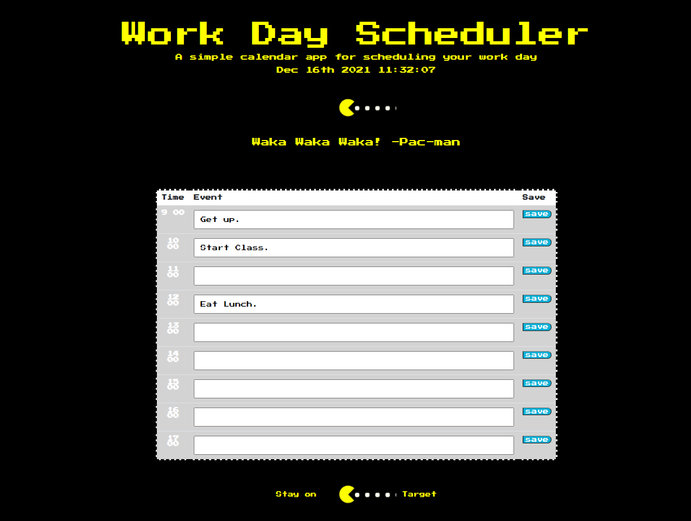

# DailyWorkSchedule_JS
## Description
- The scope of this assignment was to create a daily work planner that updates clock in real time as well as highlight time blocks based on their time period.
- This project shows how much Javascript is able to do in manipulating multiple elements and taking in additional resources such as Bootstrap, JQuery, and Moment.js.
- The issue that gave me the most difficulty was that of local storage.  I was able to attain contact with local storage and even save multiple tasks, but had extreme difficulty in getting them to render back to the display in their corresponding time-blocks.  
- I have learned a good amount of how JQuery can do some of the leg work in traversing the DOM as well as how Bootstrap can quickly roughly style a page based on a few universal classes.  Moment.js is also a great tool for working with anything related to time.
## Table of Contents

- [Installation](#installation) -- No install necessary
- [Usage](#usage)-Open in Browser
- [Credits](#credits)- See below.
- [License](#license) MIT License
## Installation
No install required
## Usage
Open in browser.  https://ajread13.github.io/DailyWorkSchedule_JS/
## Screenshot
 

N/A
## License
MIT License

Copyright (c) [2021] "Andrew J Read"

Permission is hereby granted, free of charge, to any person obtaining a copy
of this software and associated documentation files (the "Software"), to deal
in the Software without restriction, including without limitation the rights
to use, copy, modify, merge, publish, distribute, sublicense, and/or sell
copies of the Software, and to permit persons to whom the Software is
furnished to do so, subject to the following conditions:

The above copyright notice and this permission notice shall be included in all
copies or substantial portions of the Software.

THE SOFTWARE IS PROVIDED "AS IS", WITHOUT WARRANTY OF ANY KIND, EXPRESS OR
IMPLIED, INCLUDING BUT NOT LIMITED TO THE WARRANTIES OF MERCHANTABILITY,
FITNESS FOR A PARTICULAR PURPOSE AND NONINFRINGEMENT. IN NO EVENT SHALL THE
AUTHORS OR COPYRIGHT HOLDERS BE LIABLE FOR ANY CLAIM, DAMAGES OR OTHER
LIABILITY, WHETHER IN AN ACTION OF CONTRACT, TORT OR OTHERWISE, ARISING FROM,
OUT OF OR IN CONNECTION WITH THE SOFTWARE OR THE USE OR OTHER DEALINGS IN THE
SOFTWARE.
## Badges
N/A
## Features
N/A
## How to Contribute
No contributions necessary.
## Tests
Tested during milestones.